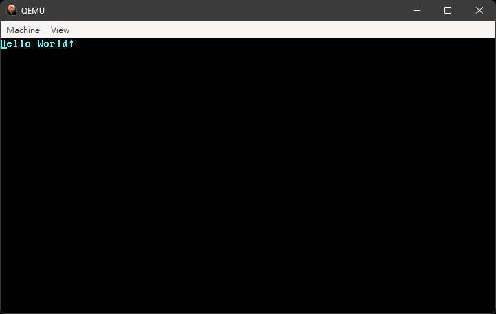

# Blog_os

- [# Part02](./dist/part02.md)

## environment

- qemu
- rust

## How run

```
git clone https://github.com/onon1101/blog_os.git -b part02
cargo install bootimage
rustup component add llvm-tools-preview
cargo run
```

and then, you will see this.


# Reference

- [blog_os](https://github.com/phil-opp/blog_os)
